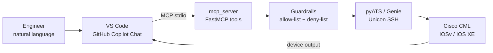

# Cisco pyATS MCP Server: run network operations from natural language in VS Code

[](https://github.com/ranilf2005/cisco-pyats-mcp-network-automation/actions/workflows/ci.yml)
[](LICENSE)
[](https://www.python.org/downloads/)
[](https://developer.cisco.com/pyats/)
[](https://modelcontextprotocol.io/)

Network engineers spend a large share of every change window and every P1 doing the
same three things: log in to a device, run a set of `show` commands, and read the
output. Automating that normally means writing and maintaining Python — a barrier
for the many engineers who are excellent at networking but do not script daily.

This project removes that barrier. It is a **Model Context Protocol (MCP) server**
that exposes **Cisco pyATS** operations as tools an AI assistant can call. With it
running, an engineer types *"run a detailed health check on iosv-0"* in GitHub
Copilot Chat, and the assistant calls a real, audited pyATS function that connects
over SSH, executes vetted commands, and returns the device output — no script
written, no credentials in the chat window.

The hard part of connecting an LLM to production-adjacent infrastructure is not the
plumbing, it is the blast radius. A model that can invent commands can invent
`write erase`. This server is therefore built around a **deny-by-default guardrail
layer**: every string the model produces is validated before it reaches a device,
configuration changes are disabled unless explicitly turned on, and a deny-list
blocks service-impacting commands outright. Those guardrails are unit tested and run
in CI without needing a device.

- **Technology stack:** Python 3.10+, Cisco pyATS/Genie with Unicon, the Model
  Context Protocol Python SDK, Cisco Modeling Labs (CML) for the topology, and
  VS Code with GitHub Copilot Chat as the MCP client.
- **Status:** 1.0.0 — Beta. Stable and usable for labs, demos and enablement
  workshops. Intended for lab environments, not production networks.
- **Devices tested:** Cisco IOSv and IOS XE nodes running in Cisco Modeling Labs.



---

## Use Case

**Problem.** Day-2 network operations are repetitive but not trivial. Gathering a
consistent health snapshot across devices, checking interface state after a change,
or capturing a running-config backup all require CLI access plus the discipline to
run the same commands the same way every time. Teams that solve this with scripts
end up with a library only a handful of people can maintain, and engineers who
cannot script are left waiting on those people.

**Solution.** Expose a small, deliberately narrow set of pyATS operations through
MCP, and let an AI assistant map plain English onto them. The assistant chooses
*which* tool to call; the server decides *what is allowed to run*. That split is the
point: the model provides the natural-language interface, the server provides the
determinism and the safety.

**Outcomes.**

| Outcome | Before | With this project |
|---|---|---|
| Health snapshot across a device | Manual CLI, inconsistent command set | One prompt, six standard commands, identical every time |
| Skill required | Python plus pyATS API knowledge | Plain English |
| Command safety | Whatever the operator types | Allow-list for reads, deny-list for writes, writes off by default |
| Auditability | Terminal scrollback | Structured tool calls logged to stderr |
| Onboarding a new engineer | Learn the script library first | Ask a question on day one |

**Benefits to the organisation.** Consistent pre- and post-change validation, fewer
outages caused by ad-hoc CLI work, faster onboarding, and an automation surface that
scales by adding devices to a testbed rather than by writing more scripts.

**Challenges solved during development.**

- *MCP stdio hygiene.* FastMCP uses stdout for protocol frames, so any stray
  `print()` or Unicon log corrupts the session. All connections use
  `log_stdout=False` and every log line goes to stderr.
- *Prompt-injection resistance.* Device output can contain text that looks like an
  instruction — an interface description is attacker-controllable. Commands are
  validated against an allow-list rather than a "looks dangerous" heuristic, and
  shell/CLI separators are rejected so a second command cannot be smuggled in.
- *Credential hygiene.* The testbed resolves credentials from environment variables
  with the pyATS `%ENV{}` markup, so no password is ever written into the repository,
  and the VS Code configuration prompts for it at runtime.
- *Session leaks.* Each tool opens and closes its own connection through a context
  manager, so a failed command never leaves a VTY line pinned.

**Ideas that would extend this.** Per-user role mapping so `apply_config` is limited
to specific engineers; Genie `learn`/`diff` snapshots for automatic pre/post change
comparison; a dry-run mode that returns the intended configuration for approval
before applying it.

---

## Installation (required)

### Prerequisites

| Requirement | Notes |
|---|---|
| Python 3.10 or later | `python3 --version`. [Download Python](https://www.python.org/downloads/) |
| Git | [Download Git](https://git-scm.com/downloads) |
| An SSH-reachable Cisco device | A [Cisco Modeling Labs](https://developer.cisco.com/modeling-labs/) node, or a [DevNet Sandbox](https://developer.cisco.com/site/sandbox/) |
| VS Code | [Download VS Code](https://code.visualstudio.com/download) |
| GitHub Copilot + Copilot Chat extensions | Installed from the VS Code Marketplace, with an active Copilot subscription |

pyATS is fully supported on Linux and macOS. On Windows, use
[WSL 2](https://learn.microsoft.com/windows/wsl/install) — the Windows-native
commands below cover the repository tooling and tests, but device connections
should be made from WSL.

### 1. Clone the repository

```bash
git clone https://github.com/ranilf2005/cisco-pyats-mcp-network-automation.git
cd cisco-pyats-mcp-network-automation
```

### 2. Create a virtual environment

**Linux / macOS / WSL**

```bash
python3 -m venv .venv
source .venv/bin/activate
python -m pip install --upgrade pip setuptools wheel
```

**Windows (PowerShell)**

```powershell
python -m venv .venv
.venv\Scripts\Activate.ps1
python -m pip install --upgrade pip setuptools wheel
```

### 3. Install dependencies

```bash
pip install -r requirements.txt
```

This installs the MCP SDK and `pyats[library]`, which includes the Genie parsers and
the Unicon connection library. Verify pyATS:

```bash
pyats version
```

### 4. Create your testbed

```bash
cp testbed/testbed.example.yaml testbed/testbed.yaml
```

Edit `testbed/testbed.yaml` and set the device name and `os` to match your lab. The
file contains **no credentials** — it references environment variables through the
pyATS `%ENV{}` markup. `testbed/testbed.yaml` is git-ignored.

Validate it:

```bash
pyats validate testbed testbed/testbed.yaml
```

### 5. Provide credentials through the environment

```bash
cp .env.example .env
```

Edit `.env` with your lab values, then load it:

**Linux / macOS / WSL**

```bash
set -a; source .env; set +a
```

**Windows (PowerShell)**

```powershell
Get-Content .env |
  Where-Object { $_ -notmatch '^\s*#|^\s*$' } |
  ForEach-Object { $k,$v = $_ -split '=',2; [Environment]::SetEnvironmentVariable($k,$v) }
```

`.env` is git-ignored. Enter the management IP address on its own — no `https://`
prefix and no trailing slash. For example `192.0.2.10`.

### 6. Run the pre-flight check

```bash
python scripts/check_env.py
```

This confirms that the dependencies import, the testbed file resolves, and the
credential variables are set. Fix anything it reports before continuing.

---

## Configuration (optional)

All configuration is supplied through environment variables, so the same code runs
in a lab, in CI, or under an MCP client without edits.

| Variable | Default | Purpose |
|---|---|---|
| `PYATS_TESTBED` | `testbed/testbed.yaml` | Path to the pyATS testbed file. Use an absolute path when launching from an MCP client. |
| `PYATS_MCP_ALLOW_CONFIG` | `false` | Master switch for `apply_config`. While `false`, the server is strictly read-only. |
| `PYATS_MCP_ALLOW_SAVE` | `false` | Additionally required before `write memory` is permitted. |
| `PYATS_MCP_ALLOWED_DEVICES` | *(empty)* | Comma-separated allow-list of device names. Empty means every device in the testbed. |
| `PYATS_MCP_CONNECT_TIMEOUT` | `60` | SSH connection timeout in seconds. |
| `PYATS_MCP_COMMAND_TIMEOUT` | `120` | Per-command execution timeout in seconds. |
| `PYATS_MCP_MAX_OUTPUT_CHARS` | `60000` | Caps a single tool response so long output cannot exhaust the model context. |
| `PYATS_MCP_INSECURE_SSH` | `false` | Set to `true` to disable SSH host key verification. Throwaway labs only. |
| `PYATS_MCP_KNOWN_HOSTS` | *(system default)* | Custom `known_hosts` file used when host key verification is enabled. |

Device credentials are separate and are consumed by the testbed:
`CML_DEVICE_IP`, `CML_DEVICE_USERNAME`, `CML_DEVICE_PASSWORD` and
`CML_DEVICE_ENABLE_PASSWORD`.

### Wiring the server into VS Code

```bash
cp .vscode/mcp.json.example .vscode/mcp.json
```

Edit `.vscode/mcp.json` and set `command` to the Python interpreter inside your
virtual environment:

- Linux / macOS / WSL: `${workspaceFolder}/.venv/bin/python`
- Windows: `${workspaceFolder}\\.venv\\Scripts\\python.exe`

The template uses a VS Code `promptString` input, so the device password is typed
into a masked prompt at start-up rather than being stored on disk. `.vscode/mcp.json`
is git-ignored.

Reload VS Code, open Copilot Chat, switch to **Agent** mode, and confirm that
`cisco-pyats-mcp` appears in the tools picker. VS Code will ask you to trust the
server because it executes local code — only trust servers you have reviewed.

---

## Usage (required)

### Run the server directly

```bash
python -m mcp_server
```

The server speaks MCP over stdio and produces no stdout output of its own; start-up
information is written to stderr. Normally you let VS Code launch it rather than
running it by hand.

### Verify connectivity without MCP

Run a command against a device using the same code path the server uses. This is the
fastest way to separate a connectivity problem from an MCP problem:

```bash
python scripts/run_show.py --device iosv-0 --command "show ip interface brief"
```

Both scripts print full usage with `--help`, and with no arguments at all:

```bash
python scripts/run_show.py --help
python scripts/check_env.py --help
```

### Tools exposed to the AI assistant

| Tool | Changes device state | Description |
|---|---|---|
| `list_devices` | No | Lists the testbed devices this server may reach. |
| `run_show_command` | No | Runs one validated `show` command. |
| `health_check` | No | `basic`: version and interface state. `detailed`: adds CPU, memory, routing summary and recent logs. |
| `backup_running_config` | No | Returns `show running-config` for offline backup or diffing. |
| `apply_config` | **Yes** | Applies configuration lines. Refuses to run unless `PYATS_MCP_ALLOW_CONFIG=true`. |

### Example prompts in Copilot Chat

Open Copilot Chat in **Agent** mode and ask:

- *"Which devices are available through the pyATS MCP server?"*
- *"Run `show ip interface brief` on iosv-0 and tell me which interfaces are down."*
- *"Do a detailed health check on iosv-0 and summarise anything that looks abnormal."*
- *"Back up the running configuration of iosv-0 and tell me whether any interface is
  missing a description."*

Copilot calls the matching tool, VS Code shows you the tool invocation for approval,
and the device output is returned into the conversation for analysis.

### Making a configuration change (opt in)

Configuration is disabled by default. Enable it only against a lab device you own:

```bash
export PYATS_MCP_ALLOW_CONFIG=true
export PYATS_MCP_ALLOWED_DEVICES=iosv-0
```

Restart the server, then ask Copilot to apply this loopback to `iosv-0`:

```text
interface loopback123
 description created-by-copilot-mcp
 ip address 10.123.123.1 255.255.255.255
```

Verify the result with a read-only call:

- *"Run `show ip interface brief | include Loopback123` on iosv-0."*

Commands such as `reload`, `write erase`, `erase`, `format`, `delete`,
`boot system`, `config-register`, `crypto key zeroize`, local `username` changes and
`no ip ssh` are rejected by the server even when configuration is enabled.

### Running the tests

The guardrail tests need no device and no pyATS installation:

```bash
pip install -r requirements-dev.txt
pytest -q
ruff check .
bandit -r mcp_server scripts -q
```

---

## Project structure

```text
cisco-pyats-mcp-network-automation/
├── mcp_server/
│   ├── __main__.py          # python -m mcp_server
│   ├── config.py            # environment-driven settings, safe defaults
│   ├── devices.py           # testbed loading and short-lived connections
│   ├── server.py            # FastMCP tool definitions
│   └── validation.py        # allow-list, deny-list, injection guards
├── scripts/
│   ├── check_env.py         # pre-flight environment validator
│   └── run_show.py          # run a show command without MCP
├── testbed/
│   └── testbed.example.yaml # credential-free template
├── tests/                   # guardrail and settings tests, no device needed
├── docs/
│   ├── lab-guide.md              # end-to-end lab build
│   ├── server-code-explained.md  # the server code, line by line
│   ├── mcp-config-explained.md   # the MCP client configuration explained
│   └── pyats-cli-cheatsheet.md   # everyday pyATS and Genie commands
├── .vscode/mcp.json.example
├── .env.example
└── .github/workflows/ci.yml
```

---

## Documentation

- [Lab guide](docs/lab-guide.md) — build the full environment from scratch,
  including CML, pyATS, the MCP server and VS Code.
- [Server code explained](docs/server-code-explained.md) — a beginner-friendly
  walkthrough of the server, aimed at engineers new to Python.
- [MCP configuration explained](docs/mcp-config-explained.md) — what every field in
  `mcp.json` does and how to troubleshoot it.
- [pyATS CLI cheat sheet](docs/pyats-cli-cheatsheet.md) — the pyATS and Genie
  commands used most often in labs and CI/CD.
- [Security policy](SECURITY.md) — guardrails, operator responsibilities and how to
  report a vulnerability.

---

## Related Sandbox

No hardware is required. Both of these give you SSH-reachable Cisco devices:

- [Cisco DevNet Sandbox catalogue](https://developer.cisco.com/site/sandbox/) —
  reserve or use an always-on IOS XE sandbox, then put its address and credentials
  in `.env` and point `testbed/testbed.yaml` at it.
- [Cisco Modeling Labs](https://developer.cisco.com/modeling-labs/) — build the
  IOSv topology used throughout [docs/lab-guide.md](docs/lab-guide.md).

When using a shared sandbox, keep `PYATS_MCP_ALLOW_CONFIG=false` so the server stays
read-only.

---

## Links to DevNet Learning Labs

- [Cisco pyATS on DevNet](https://developer.cisco.com/pyats/) — start here for
  test automation concepts.
- [pyATS documentation](https://developer.cisco.com/docs/pyats/) — testbed schema,
  Unicon connections and the Genie libraries.
- [DevNet Learning Labs](https://developer.cisco.com/learning/) — network
  programmability and automation fundamentals.
- [Cisco Modeling Labs documentation](https://developer.cisco.com/docs/modeling-labs/) —
  building and running the virtual topology.

---

## Known issues

- **Windows-native pyATS.** pyATS is supported on Linux and macOS. On Windows, run
  the server inside WSL 2. The repository's tests and linters run natively on
  Windows.
- **One command per call.** `run_show_command` deliberately accepts a single `show`
  command with at most one pipe modifier. Ask for several commands and the assistant
  will make several tool calls.
- **Connection cost.** Each tool call opens and closes its own SSH session, which
  favours safety over speed. A multi-command request takes a few seconds per call.
- **Deny-list, not authorisation.** The configuration deny-list is a safety net. Real
  authorisation must be enforced on the device with AAA and command authorisation.
- **Genie parsing not yet exposed.** Tools return raw CLI text. Structured
  `genie parse` output is on the roadmap.
- **Sensitive output.** Device output returned to the assistant may include
  addressing and routing detail. Do not point the server at devices whose
  configuration must not leave your environment.

Track and report issues at
[GitHub Issues](https://github.com/ranilf2005/cisco-pyats-mcp-network-automation/issues).

---

## Getting help

1. Run `python scripts/check_env.py` — it diagnoses most setup problems.
2. Confirm pyATS itself works:
   `python scripts/run_show.py --device <name> --command "show version"`.
   If that fails, the issue is connectivity or credentials, not MCP.
3. If the tools do not appear in Copilot Chat, check that `.vscode/mcp.json` is
   valid JSON, that `command` points at the interpreter inside `.venv`, and that all
   paths are absolute. Then inspect the MCP server output in the VS Code Output
   panel.
4. Review the troubleshooting sections of
   [docs/lab-guide.md](docs/lab-guide.md) and
   [docs/mcp-config-explained.md](docs/mcp-config-explained.md).
5. Still stuck? [Open an issue](https://github.com/ranilf2005/cisco-pyats-mcp-network-automation/issues/new/choose)
   using the bug report template, or ask in the
   [Cisco DevNet Community](https://community.cisco.com/t5/developer-hub/ct-p/4409j-developer-home).

---

## Getting involved

Contributions are welcome. The areas that would benefit most right now:

- **New read-only tools** — BGP neighbour verification, OSPF adjacency checks,
  interface error counters.
- **Genie integration** — expose `genie learn` and `genie diff` so pre- and
  post-change snapshots can be compared automatically.
- **Broader platform coverage** — NX-OS and IOS XR testbed examples and tests.
- **A dry-run mode** for `apply_config` that returns the intended change for
  approval before it is applied.

Read [CONTRIBUTING.md](CONTRIBUTING.md) for the development setup, the checks to run
before opening a pull request, and the rules every new MCP tool must follow. All
participants are expected to follow the [Code of Conduct](CODE_OF_CONDUCT.md).

---

## Credits and references

**Author:** Ranil Fernando

**Built on**

- [Cisco pyATS and Genie](https://github.com/CiscoTestAutomation/pyats) — the test
  and automation framework doing the real work.
- [Unicon](https://github.com/CiscoTestAutomation/unicon) — device connection
  handling.
- [Model Context Protocol](https://modelcontextprotocol.io/) and the
  [Python SDK](https://github.com/modelcontextprotocol/python-sdk) — the standard
  that lets an assistant call these tools.
- [MCP servers in VS Code](https://code.visualstudio.com/docs/copilot/chat/mcp-servers) —
  client-side configuration reference.
- [Cisco Modeling Labs](https://developer.cisco.com/modeling-labs/) — the virtual
  topology used for development and testing.

**Inspired by** the Cisco DevNet NetDevOps community and the
[Code Exchange repository template](https://github.com/CiscoDevNet/code-exchange-repo-template).

---

## Licensing info

This code is licensed under the **GNU General Public License v3.0 or later**. See
[LICENSE](LICENSE) for the full text and [NOTICE](NOTICE) for the copyright notice
and third-party attributions.

Copyright (c) 2026 Ranil Fernando.

---

## Disclaimer

This is an independent community project. It is **not** an official Cisco product,
is not supported by Cisco TAC, and carries no Cisco warranty. It is intended for
lab, demonstration and enablement use. Review [SECURITY.md](SECURITY.md) before
pointing it at any device you care about.

Cisco, Cisco Modeling Labs, pyATS, Genie and IOS are trademarks or registered
trademarks of Cisco Systems, Inc.
